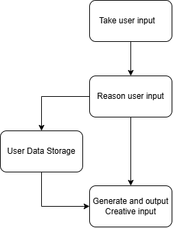

# aiclass

Student Name: Jack Heintzeman  
Date: 26/09/26
Assignment Title: Project Exercise 2-1: Designing and Evaluating an AI Agent

README Template: AI Agent Design and Evaluation

This template is designed to guide you through the Project Exercise 2-1: Designing and Evaluating an AI Agent assignment. You will use this to complete the no-code programming tasks below.
This document serves as a README file that introduces a project by explaining its purpose, setup instructions, and usage details, helping users and collaborators quickly understand what 
the project does and how to work with it. It also serves as a reference point for future development, troubleshooting, and onboarding new contributors.

Task 1: Complete this section and select one of the following scenarios for your AI agent: [Creative Assistant AI]
1. Study Buddy AI
2. Community Helper AI
3. Creative Assistant AI
4. Personal Wellness AI
5. Smart Retail AI

Task 2: Define the AI agent by brainstorming the answers to the following questions. Add your responses here for Agent Overview:

1. What data does this AI need to collect? [data about the user for creativity help.]

2. How does it interact with users? [Communicats with the user and helps with the creative process. Stores data about the user.]

3. What decisions does it make? [How data is used, how to respond to user input, and what to reccomend.]

4. What is its main goal? [Act as a digital Creative Assistant.]

5. How could it be misused, even if unintentionally? [Unintentional plagiarism or accidental misinformation]

Task 3: Add your flowchart image here from draw.io "No-Code Programming." 

AI Agent logical flowchart: Use markdown and diagrams within [draw.io](https://draw.io/) to create a visual flowchart of your AI agent's core decision-making process. For example to replace with this image, just delete this link then copy and paste your image here. You must do this while in the Readme file as it will convert to a html hyperlink tag.
<!--  -->

Task 4. Add your agents Ethical Evaluation descriptions.

Complete the descriptions below for your AI Agent Design and Ethics Evaluation.

Features	            Agent Task                                      Your Response 
Scenario Selection    Choose one AI agent scenario           	        [Creative Assistant AI]
Agent Task #1	      Helpful/ethical                                   [The AI helps users brainstorm original ideas.] 
                      Potentially unethical                             [The AI could generate information that resembles someone else's work.]
Agent Task #2	      Helpful/ethical                                   [The AI asks about the user's creative goals and stores that information.]
                      Potentially unethical                             [The AI could ask for more personal information that it needs, violating the users privacy.]
Agent Task #3	      Helpful/ethical                                   [The AI provides feedback on a user's creative work.]
Agent Task #4	      Helpful/ethical                                   [The AI explains it's suggestions and warns the users of potential inaccuracies.]
Agent Task #5	      Helpful/ethical                                   [The AI provies multiple creative options instead of just one. ]
Data Use              What data does this AI need to collect?        	[The users desires, interest and creative needs.]
User Interaction      How does the AI interact with users?              [Store data about the user and communicate about creative processes]
Decision-Making       What decisions does it make and how?    	        [It reasons how to help the users with a creative task by tappin into the stored user data for reference.]
Main Goal	      What is the AI designed to accomplish?            [Act as a digital Creative Assistant.]
Misuse Risk	      How could the AI be misused or misunderstood?     [If the user uses the assistant as an authoritative figure or uses it plagiarize work.]

Task 5: Complete the Ethical AI Principles Evaluation questions for your agent.

Principle:	Does your AI uphold this principle? How or why not?

Yes beucause it only stores data it needs and it respects the privacy of the user.

Equity over efficiency [
    The AI should prioritize giving users fair and useful assistance rather than simply producing responses as quickly as possible. It should treat users respectfully and avoid making assumptions based on their background, abilities, or creative interests. However, the AI may still produce biased suggestions, so its responses should be reviewed carefully.
]
Transparency and explainability	[
    The AI should be transparent about the fact that its suggestions are AI-generated. It should explain its recommendations when appropriate and acknowledge uncertainty when it does not know something. Users should also understand what information the AI collects and how that information is used.
]
Inclusive design practices	[
    The AI should be designed so that people with different backgrounds, abilities, communication styles, and levels of creative experience can use it. It should avoid assumptions about what users can or cannot create and provide different ways to approach creative tasks.
]
Historical and social awareness	[
    The AI should recognize that creative work can be influenced by different cultures, historical events, and social experiences. It should avoid stereotypes and should provide context when discussing culturally or historically sensitive subjects.
]

Task 6. Answer the following final discussion questions.
1. After designing and evaluating your AI agent, what is the most significant ethical challenge you identified? 
2. How might you mitigate this challenge in a real-world application?
3. What was the most challenging part of this creating the design for this agent? 
4. What new insights did you gain about AI ethics and design?

